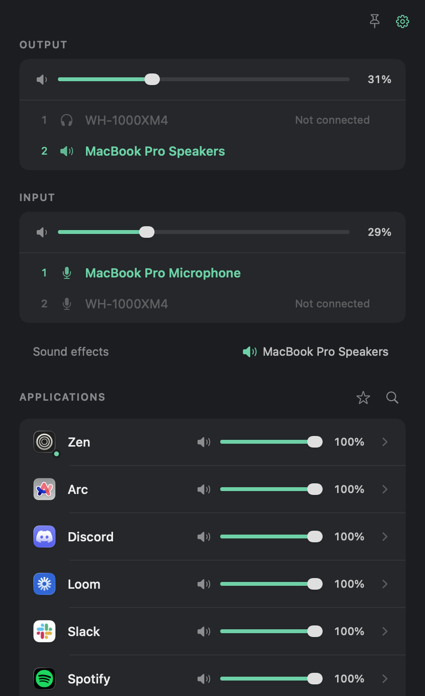

# FreeSound

A free macOS menu bar mixer. Pick which speakers and mic to use, rank your fallbacks, and give every app its own volume.



## Why

I wanted two things from my Mac's audio. When I unplug my headphones, sound should go where I said, not wherever macOS feels like. And each app should have its own volume, so a call doesn't have to fight a video.

The paid apps do this, and then they charge a subscription for it, want an account, and ship a kernel driver. That felt like a lot for a couple of sliders. So I made this one. No account, no driver, no money. It uses Apple's own Core Audio APIs and nothing else.

## Install

Grab the ZIP for your Mac from [Releases](https://github.com/lg-epitech/free-sound/releases), arm64 for Apple Silicon or x86_64 for Intel. Move `FreeSound.app` to Applications and open it. The builds aren't notarized, so the first launch needs a trip to System Settings, Privacy & Security, Open Anyway.

Or build it yourself. You need macOS 14.2 or later and the Command Line Tools (`xcode-select --install`), nothing more.

```sh
./scripts/run.sh
```

`./scripts/build.sh --install` puts a copy in `~/Applications`.

## Using it

Click the waveform in the menu bar. The mixer drops down at the top right. Click anywhere else and it goes away. Pin it if you want it to stay.

Output and Input are ranked lists. Number one is what you want, number two is the fallback, and so on. Drag to reorder. The first connected device in the list is the one in use, shown in green. Unplug it and the next one takes over. Plug it back in and it takes over again. A device you've unplugged stays in the list as "Not connected" so it keeps its place. Hover it and click the cross to forget it.

Clicking another connected device switches to it for now. The list is applied again the next time something is plugged in or unplugged.

Every app that plays sound gets a row. Drag its slider. The first time you do, macOS asks for permission to capture system audio. Say yes, that's how per-app volume works. Open the row's chevron for balance, a boost past 100%, and a different output for just that app.

Apps you haven't touched keep their normal audio path. FreeSound only steps in for the ones you adjust. Turn off App controls in the gear menu and everything goes back to normal.

## Limits

This is a small tool, not a studio. There's no equalizer, no effects, and no saved presets.

Some HDMI, USB, and Bluetooth devices don't let macOS change their volume. They still work as outputs, the slider just says Fixed. Per-app mixing needs macOS 14.2 because it uses Core Audio process taps, and a few apps with protected content won't cooperate.

If an app's chosen output disappears, its sound falls back to the system output and the row shows an orange arrow. That can mean speakers, suddenly. You've been warned.

## Development

```sh
./scripts/test.sh
```

That runs the DSP checks under the sanitizers, the preference and priority checks, and a read-only pass over your real audio devices. [docs/TESTING.md](docs/TESTING.md) has the architecture notes, the release process, and a hardware checklist for the things a script can't hear.

## License

MIT. Not affiliated with Rogue Amoeba or SoundSource, and contains none of their code.
